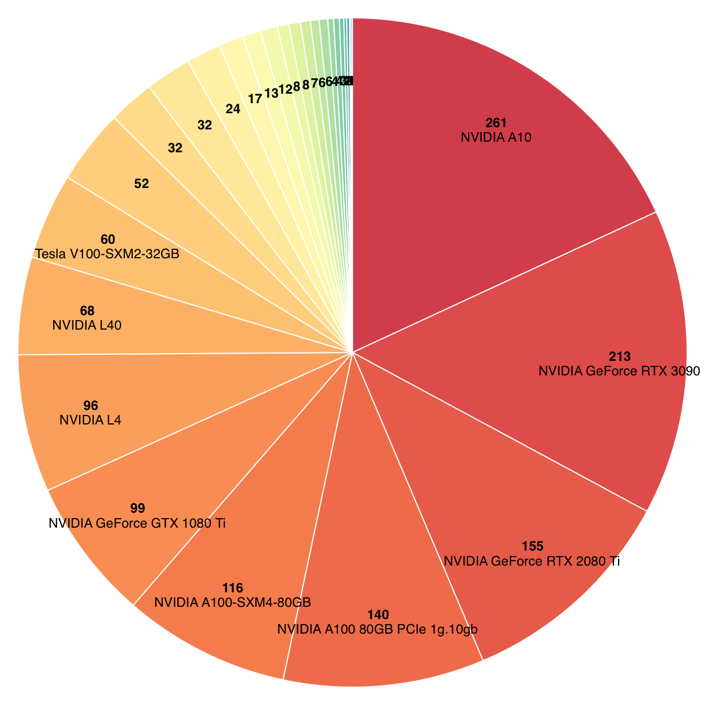
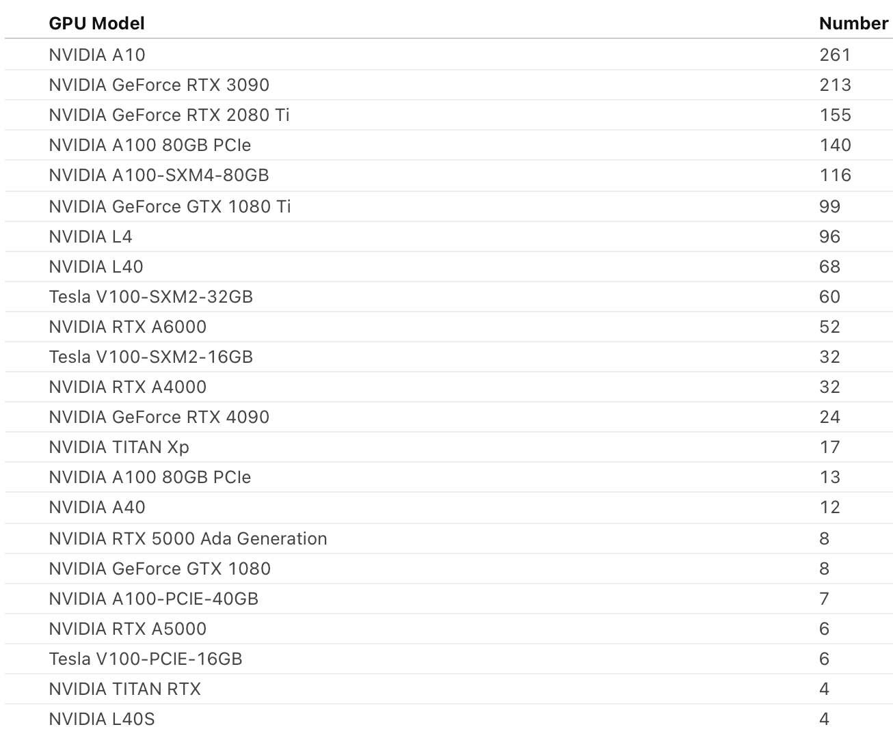
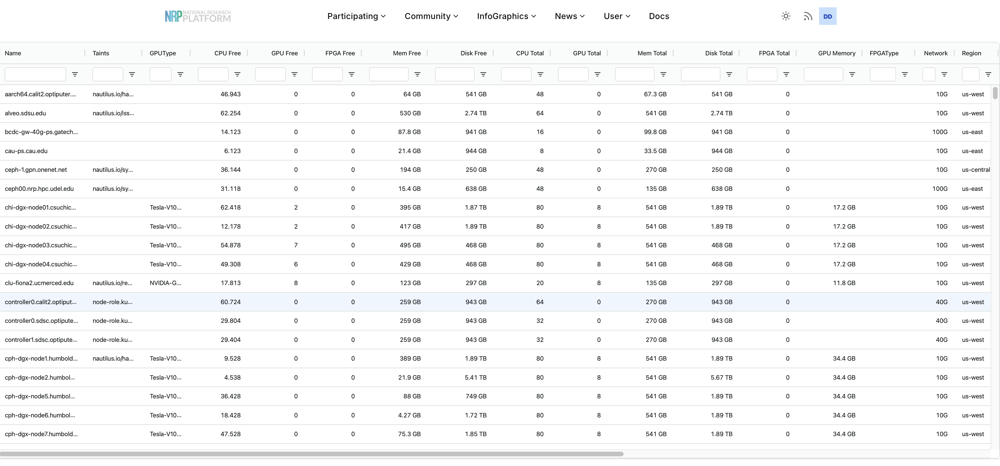
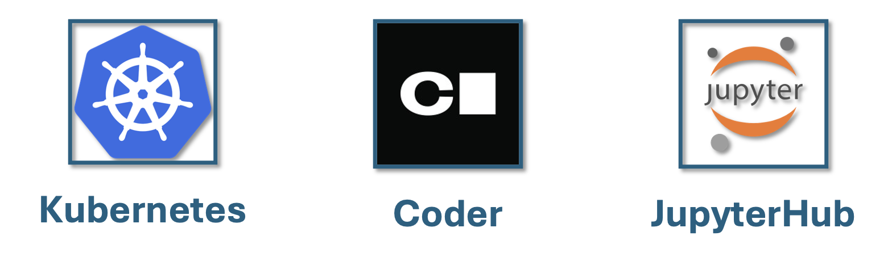
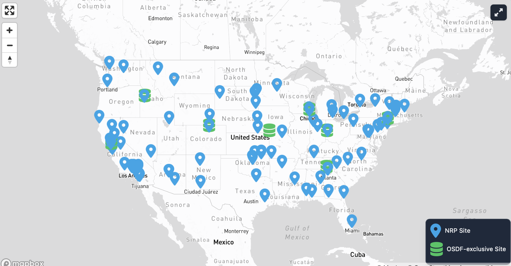
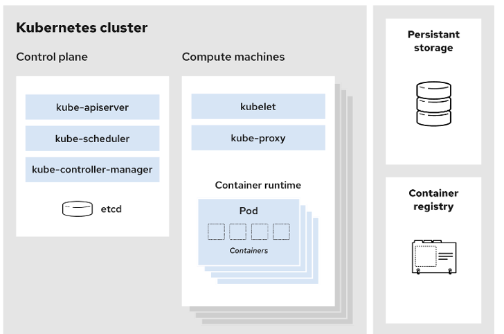

# 2. Requesting GPUs on NRP (Instructor: Daniel Diaz)

This session guides participants through the process of requesting GPUs and other compute resources on the National Research Platform (NRP). Attendees will be introduced to the NRP portal, where they can explore available hardware, including standard GPUs and the Qualcomm Cloud AI 100 Ultra SoCs. The tutorial demonstrates how to submit a resource request, select the appropriate GPU type for a given workload, and understand scheduling constraints and allocation quotas.

---
# GPUs on NRP
<style>
.gpu-row { display: flex; gap: 16px; align-items: flex-start; flex-wrap: wrap; }
.gpu-row img { height: clamp(220px, 30vw, 320px); width: auto; max-width: 100%; object-fit: contain; display: block; }
.gpu-row .pie { transform: scale(0.92); transform-origin: top left; }
@media (max-width: 768px) { .gpu-row img { height: auto; width: 100%; max-width: 480px; } }
</style>

<div class="gpu-row">
  
  
</div>

There are many types of GPU available on NRP!

You can view live availability of all resources at [https://nrp.ai/viz/resources/](https://nrp.ai/viz/resources/)

 

# Interacting with NRP



The majority of NRP users interact with the cluster using the following three methods.
- via **Kubernetes**: Directly submit and manage containerized workloads (services and batch jobs) using Kubernetes APIs and tools like `kubectl`.
- via the **Coder** service: Launch a browser-based VS Code environment connected to cluster resources for interactive development and execution.
- via NRP deployed **Jupyterhub**: Start a JupyterLab notebook server on the cluster for interactive analysis, prototyping, and teaching workflows.

Today, we will be using two of these services. We will launch a jupyterhub server. From the jupyterhub server, we will interact with kubernetes directly using the hub's terminal. 

If you have not already done so, please use the following link to [Launch NAIRR Tutorial Workspace](https://training.nrp-nautilus.io/hub/user-redirect/git-pull?repo=https%3A%2F%2Fgithub.com%2Fnrp-nautilus%2Fnairr-tutorial&branch=main&urlpath=lab%2Ftree%2Fnairr-tutorial%2F)

<div style="text-align:center;">
  
</div>

- When you launch your notebook, you should see a screen like this.
- Let's set up our workspace to view these instructions and the terminal. 

<div style="text-align:center;">
  
</div>


###  Hands-on: Explore GPU options on NRP
```bash
#  print list of NRP nodes with GPU label 
kubectl get nodes -L nvidia.com/gpu.product
```

<details>
  <summary>Click to reveal output</summary>
  
```bash
  NAME                                         STATUS                     ROLES            AGE      VERSION    GPU.PRODUCT
aarch64.calit2.optiputer.net                 Ready                      <none>           2y234d   v1.33.8    
admiralty-ncmir-mm-expanse-7d43bc97a0        Ready                      cluster,master   13d                 
admiralty-ndp-voyager                        Ready                      cluster,master   13d                 
alveo.sdsu.edu                               Ready                      <none>           3y245d   v1.33.8    
bcdc-gw-40g-ps.gatech.edu                    Ready                      <none>           2y315d   v1.33.8    
cau-ps.cau.edu                               Ready                      <none>           361d     v1.33.8    
cenic-nrp1.hpc.cpp.edu                       Ready                      <none>           17d      v1.33.8    NVIDIA-RTX-A6000
ceph-1.gpn.onenet.net                        Ready                      <none>           4y293d   v1.33.8    
ceph00.nrp.hpc.udel.edu                      Ready                      <none>           3y261d   v1.33.8    
chi-dgx-node01.csuchico.edu                  Ready                      <none>           165d     v1.33.8    Tesla-V100-SXM2-16GB
chi-dgx-node02.csuchico.edu                  Ready                      <none>           165d     v1.33.8    Tesla-V100-SXM2-16GB
chi-dgx-node03.csuchico.edu                  Ready                      <none>           171d     v1.33.8    Tesla-V100-SXM2-16GB
chi-dgx-node04.csuchico.edu                  Ready                      <none>           163d     v1.33.8    Tesla-V100-SXM2-16GB
clu-fiona2.ucmerced.edu                      Ready                      <none>           122d     v1.33.8    NVIDIA-GeForce-GTX-1080-Ti
```
</details>

# The Nautilus Cluster
NRP operates on a Kubernetes cluster called **nautilus**. 

- **Platform:** Nautilus is a Kubernetes cluster
- **Control plane:** manages the cluster and worker nodes
- **Worker nodes:** run pods and provide the Kubernetes runtime environment
- **Operational history:** in continuous operation for **6 years**

## Capabilities

- **Storage:** CephFS, CVMFS, S3
- **Monitoring:** PerfSONAR, traceroute, Prometheus
- **Compute and data tools:** JupyterHub, WebODM, GitLab, Nextcloud, Overleaf
- **Collaboration tools:** Jitsi, EtherPad, HedgeDoc, Syncthing

## Scale

- **500+ nodes**
- **1500+ GPUs**
- **50+ FPGAs**

<style>
.image-row {
  display: flex;
  gap: 16px;
  align-items: center;
  flex-wrap: nowrap;
}

.image-row img {
  width: calc(50% - 8px);
  max-width: 100%;
  height: auto;
  display: block;
  object-fit: contain;
}

@media (max-width: 768px) {
  .image-row {
    flex-wrap: wrap;
  }

  .image-row img {
    width: 100%;
  }
}
</style>

<div class="image-row">
  
  
</div>

# Kubernetes basics (quick intro)
Kubernetes is a system for running applications on a cluster by managing **workloads** (things you want to run) and keeping them in the desired state.

Most interactions with Kubernetes involve creating and updating **resources** (objects) described in **YAML**.
- A YAML “manifest” declares the *desired state* (what you want running)
- Kubernetes works continuously to make the cluster match that desired state

Typical workflow:
1. Write or edit a YAML manifest
2. Apply it to the cluster (e.g., `kubectl apply -f ...`)
3. Check status and troubleshoot (pods, logs, events)

## Kubernetes workloads
Workloads are the resource types you use to run containers on the cluster.

- **Pod**: the basic unit where your application runs (one or more containers together)
- **Job**: runs work to completion (batch or one-off tasks)
- **Deployment**: manages long-running services and keeps them available (including rolling updates)

Rule of thumb:
- Use a **Job** when the work should finish.
- Use a **Deployment** when the work should keep running.

## Keep in mind
- pods are **ephemeral**. Once a pod is terminated all data is deleted.
- **Persistent volume claims** (PVCs) are used to claim long term storage.
- Kubernetes nodes are typically not accessed directly by users. Instead, users define their workloads in **YAML files** and submit them to the cluster using kubectl, which can be run from any machine that has it installed, such as a local computer.


## Docker and containers
Docker is a tool for building and running **containers**.

A container image packages:
- your application code
- libraries and dependencies
- enough operating-system files to run consistently

This makes the environment portable: the same image can run on your laptop, a VM, or on a Kubernetes cluster.
### Why Docker matters for Kubernetes
Kubernetes runs **container images**. It does not build them.

In practice:
- You build a container image (with Docker or another tool)
- Kubernetes pulls that image and runs it as part of your workload

### Container registries
A **container registry** stores and distributes container images.

- Public example: Docker Hub
- Organizations often use private registries for internal images

NRP note:
- NRP GitLab provides a container registry (public or private depending on repo settings)
- You can push local images to GitLab’s registry, or build/publish images using GitLab CI/CD

## Hands on
In this session we will go through some commone kubectl commands and show you how to create some kubernetes objects.
In your jupyterhub server you can find some yaml files in the the **/nairr-tutorial/yamls/** directory in the sidebar. Find the file `test-pod.yaml` and open it in the editor

### Creating a simple pod
Edit the following `test-pod.yaml` file to give the pod a unique **name**.
```yaml
apiVersion: v1
kind: Pod
metadata:
  name: test-pod-<name>
spec:
  containers:
  - name: mypod
    image: ubuntu
    resources:
      limits:
        memory: 100Mi
        cpu: 100m
      requests:
        memory: 100Mi
        cpu: 100m
    command: ["sh", "-c", "echo 'Hello from NRP!' && sleep 3600"]
```
- Now, launch this pod with the following
```bash
#navigate to yamls directory and create pod
cd ~/nairr-tutorial/yamls/
kubectl create -f test-pod.yaml
```
- Check if you were successful by running 
```bash
kubectl get pods
# Get detailed pod information
kubectl get pod test-pod-<name> -o wide
```
- Have a look at the logs associated with this pod
```bash
# View pod logs
kubectl logs test-pod-<name>
```
- View detailed pod information by running
```bash
# Print pod details
kubectl describe pod test-pod-<name>
```
- Execute a command from the pod
```bash
# Execute a command in the pod
kubectl exec test-pod-<name> -- echo 'Command executed successfully'
```
- Shell into the pod for an interactive session
```bash
# Get interactive shell access to the pod
kubectl exec -it test-pod-<name> -- /bin/bash
```
- Finally clean up the pod to free up any resources
```bash
# Delete the pod
kubectl delete pod test-pod-<name>
```

# Monitoring
We collect many metrics in real time to help users evaluate the performance of their workloads. 
We have created a number of dashboards showing both historical and up-to-date metrics on Grafana.
- [Grafana dashboards](https://grafana.nrp-nautilus.io/dashboards)
- [Grafana: namespace pod dashboard](https://grafana.nrp-nautilus.io/d/85a562078cdf77779eaa1add43ccec1e/kubernetes-compute-resources-namespace-pods)
- [Grafana: namespace GPU dashboard (for later)](https://grafana.nrp-nautilus.io/d/dRG9q0Ymz/k8s-compute-resources-namespace-gpus)

Many clusters have an acceptable use policy (including NRP). The most important thing to keep in mind is that **NRP is a shared resource**. Ensure that any resource you are requesting is used efficiently and when you are done, you must release the resource back to the cluster. 

At NRP we aim for the utilization of user pods to have GPU > 40%, CPU 20-200%, RAM 20-150% of requested amount.

You can find our cluster usage policies in our docs:[https://nrp.ai/documentation/userdocs/start/policies/](https://nrp.ai/documentation/userdocs/start/policies/)

---

# Hands On: Basic GPU Pod

Examine the contents of `gpu-pod.yaml`.  The following block is used to specify that we are requesting one GPU for our workflow:
```yaml
    resources:
      limits:
        nvidia.com/gpu: 1
      requests:
        nvidia.com/gpu: 1
```

Now let's launch this pod.
```bash
# launch single gpu pod
kubectl create -f gpu-pod.yaml
# check that the pod is created
kubectl get pods 
```
- Once the pod is in a ready state, we can exec into the pod
```bash
kubectl exec -it <name>-gpu-XXXXX -- /bin/bash
```
- Try running `nvidia-smi` from within the pod.

**Important** This pod will remain indefinitely due to the sleep infinity command. We must terminate it.

```bash
kubectl delete pod <name>-gpu-XXXXX
```

<details>
<summary>Click to reveal</summary>

```bash
root@ddiaz-gpu-z9dc8:/# nvidia-smi
Tue Mar 10 08:59:32 2026       
+-----------------------------------------------------------------------------------------+
| NVIDIA-SMI 580.126.09             Driver Version: 580.126.09     CUDA Version: 13.0     |
+-----------------------------------------+------------------------+----------------------+
| GPU  Name                 Persistence-M | Bus-Id          Disp.A | Volatile Uncorr. ECC |
| Fan  Temp   Perf          Pwr:Usage/Cap |           Memory-Usage | GPU-Util  Compute M. |
|                                         |                        |               MIG M. |
|=========================================+========================+======================|
|   0  NVIDIA GeForce GTX 1080 Ti     On  |   00000000:06:00.0 Off |                  N/A |
| 28%   23C    P8              8W /  250W |       3MiB /  11264MiB |      0%      Default |
|                                         |                        |                  N/A |
+-----------------------------------------+------------------------+----------------------+

+-----------------------------------------------------------------------------------------+
| Processes:                                                                              |
|  GPU   GI   CI              PID   Type   Process name                        GPU Memory |
|        ID   ID                                                               Usage      |
|=========================================================================================|
|  No running processes found                                                             |
+-----------------------------------------------------------------------------------------+
```
</details>

## Useful options

### Specific GPU type
Sometimes you need a specific type of GPU for your job. You can request nodes with the hardware you need using your config yaml:
```yaml
spec:
 affinity:
   nodeAffinity:
     requiredDuringSchedulingIgnoredDuringExecution:
       nodeSelectorTerms:
       - matchExpressions:
         - key: nvidia.com/gpu.product
           operator: In
           values:
           - NVIDIA-GeForce-GTX-1080-Ti
```

You can find a list of GPU label values at [https://nrp.ai/documentation/userdocs/running/gpu-pods/](https://nrp.ai/documentation/userdocs/running/gpu-pods/).

You can also GPU.PRODUCT column of 
```bash
kubectl get nodes -L nvidia.com/gpu.product
```

### Specific CUDA version

If you need a specific version of CUDA installed, you can request this similarly using nodeAffinity:
```yaml
spec:
  affinity:
    nodeAffinity:
      requiredDuringSchedulingIgnoredDuringExecution:
        nodeSelectorTerms:
        - matchExpressions:
          - key: nvidia.com/cuda.runtime.major
            operator: In
            values:
            - "12"
          - key: nvidia.com/cuda.runtime.minor
            operator: In
            values:
            - "2"
```

Again, you can use the `get nodes` function to print details about the CUDA version installed at each node. Or you can take a look at the relevant columns of [https://nrp.ai/viz/resources/](https://nrp.ai/viz/resources/).
```bash
kubectl get nodes -L nvidia.com/cuda.driver.major,nvidia.com/cuda.driver.minor,nvidia.com/cuda.runtime.major,nvidia.com/cuda.runtime.minor -l nvidia.com/gpu.product
```

## Special GPUs
Note that some GPUs are labeled as special resources on the cluster and cannot be scheduled using `nvidia.com/gpu`. Please see [here](https://nrp.ai/documentation/userdocs/running/gpu-pods/) for more information about these resources. 

```yaml

    resources:
      limits:
        nvidia.com/a40: 1
      requests:
        nvidia.com/a40: 1
```

# Hands On: Tensflow Benchmarking

For this job, one launcher pod creates two **GPU** worker pods, and runs a distributed TensorFlow ResNet-101 benchmark across them using MPI and Horovod.

Be sure to first edit `mpi-tensorflow.yaml` replacing \<name\> with a unique name.
```bash
kubectl create -f mpi-tensorflow.yaml 
```
- To check the progress
```bash
kubectl get pods
# Once the launcher pod is in a running state
kubectl logs -f  <name>-mpi-tensorflow-XXXXX-launcher-YYYYY 
```

### Question
- What metrics would you look at for this job?
- Which pods do you expect to see GPU utilization?
- How is your GPU utilization for this job? How about memory?
- Do the number of CPU you are requesting seem appropriate?
- Should you adjust any of your resource request for better efficiency?

# Hands On: MPI-pi
We will use a custom workload called a **mpijob**, created using `mpi-pi.yaml`. This workload will create one launch pod and two worker pods. The launch pod will initiate a job to compute the value of $\pi$ and the worker pods will be used to execute this job.

Be sure to first edit `mpi-pi.yaml` replacing \<name\> with a unique name.
```bash
kubectl create -f mpi-pi.yaml 
```
- To check the progress
```bash
kubectl get pods
# Once the launcher pod is in a running state
kubectl logs -f  <name>-mpi-pi-kq7pt-launcher-XXXXX
```
<details>
  <summary>Click to reveal expected result</summary>

  ```bash
# running on worker pods
Rank 1 on host ddiaz-mpi-pi-4lrz7-worker-1
Workers: 2
Rank 0 on host ddiaz-mpi-pi-4lrz7-worker-0
pi is approximately 3.1410376000000002
```
-or-
```bash
# running on host as fallback
Distributed transport failed; falling back to local launcher-only run for demo reliability...
Workers: 2
Rank 0 on host ddiaz-mpi-pi-jzrvt-launcher
Rank 1 on host ddiaz-mpi-pi-jzrvt-launcher
pi is approximately 3.1410376000000002
```
</details>


- To clean up
```bash
kubectl get mpijob
kubectl delete mpijob <name>-mpi-pi-XXXXX
```

### Question
- What metrics would you look at for this job?


## End

**Please make sure you did not leave any running pods. Jobs and associated completed pods are OK.**


